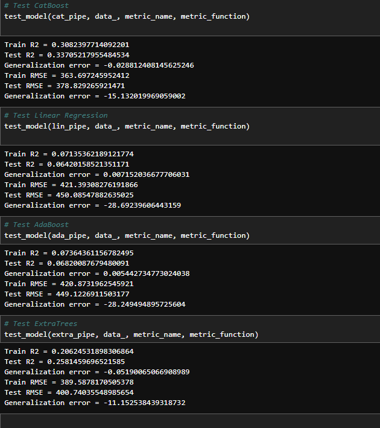
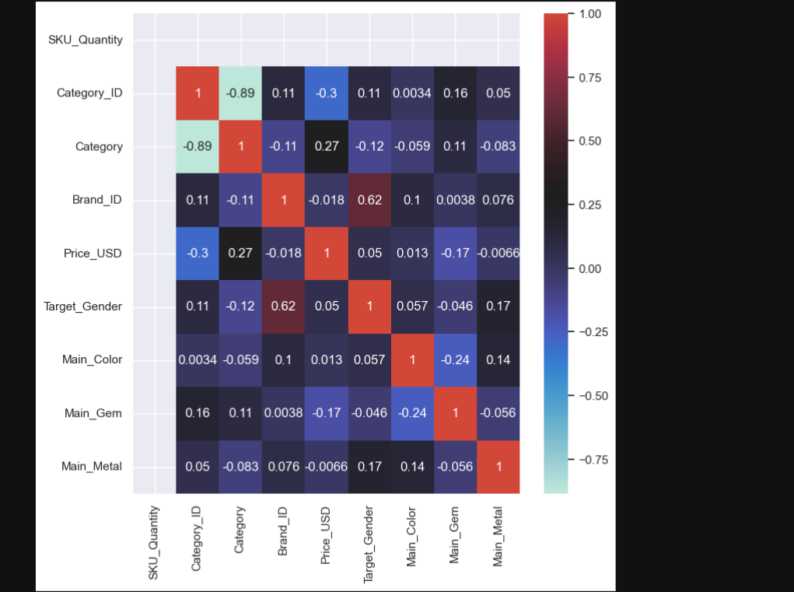
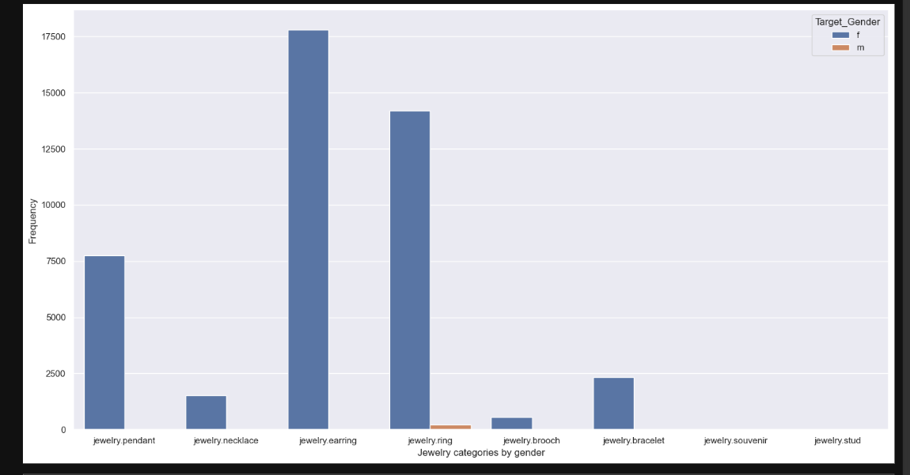
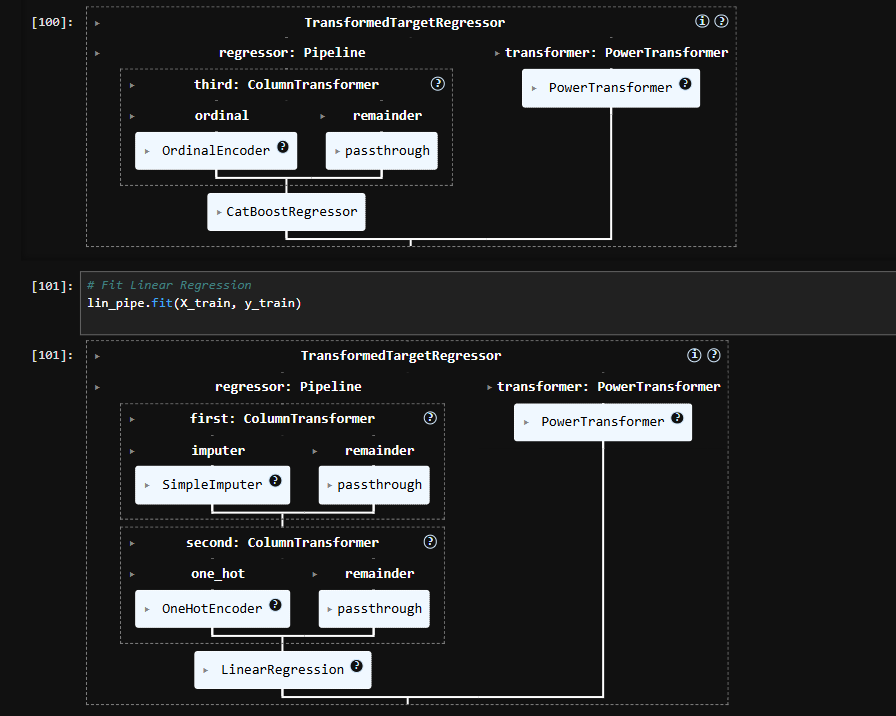
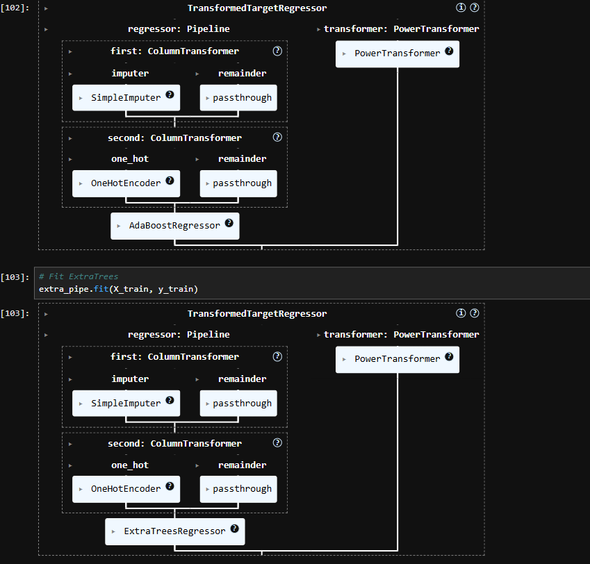

# gemineye-price-optimizer
ML pipeline for jewelry price prediction using CatBoost, Linear Regression, AdaBoost, and ExtraTrees models with comprehensive data analysis

This project is a machine learning solution for Gemineye Emporium's jewelry pricing optimization using multiple regression models and advanced pipeline techniques.

## Business Context

### Overview
Gemineye Emporium has evolved from a small jewelry provider to a large-scale jewelry designing and trading company. This rapid expansion has introduced complexities in their pricing strategy, particularly due to:
- In-house manufacturing operations
- Import operations
- Complex logistics requirements

### Core Business Challenges
1. **Price Determination Complexity**
   - Difficulty in determining optimal prices
   - Price inflation due to operational complexity

2. **Business Objectives**
   - Maximize investment profits
   - Maintain competitive pricing
   - Balance profitability with affordability

3. **Specific Challenges**
   - **Market Dynamics**: Adapting to trends, fashion, and consumer preferences
   - **Competitive Pricing**: Balancing uniqueness with market rates
   - **Cost Management**: Optimizing materials, craftsmanship, and overhead costs

### Project Rationale
- **Profitability**: Optimize price-cost-demand balance
- **Customer Satisfaction**: Maintain competitive pricing for quality products
- **Adaptability**: Enable dynamic pricing based on market conditions

## Project Aims
1. **Model Development**: Create ML models for optimal price prediction
2. **Feature Engineering**: Identify and create relevant predictive features
3. **Model Explainability**: Ensure transparent, trustworthy predictions

## Data Description

### Data Requirements
1. **Jewelry Data**
   - Gemstone type
   - Metal type
   - Weight
   - Craftsmanship details

2. **Market Data**
   - Historical trends
   - Competitor prices
   - Consumer preferences
   - Sales timing

### Feature Set
- Order datetime
- Order ID
- Purchased product ID
- SKU Quantity
- Category ID and alias
- Brand ID
- Price in USD
- User ID
- Product gender
- Main Color
- Main metal
- Main gem

## Technical Analysis

### Model Performance Metrics

Shows detailed comparison of all model metrics including R2 scores and RMSE.

### Feature Correlation Analysis

Demonstrates relationships between:
- SKU_Quantity and Category_ID (-0.89 correlation)
- Brand_ID and Target_Gender (0.62 correlation)
- Price_USD relationships with other features

### Category Distribution Analysis

Visualizes:
- Product category frequencies
- Gender-based distribution patterns
- Category popularity rankings

### Pipeline Architecture

Details the implementation of:
- Data transformation workflow
- Feature preprocessing steps
- Model integration process

## Model Performance Analysis

### Key Observations

1. **Overall Model Performance**
   - CatBoost: Highest R2 scores (Train: 0.308, Test: 0.337)
   - Linear Regression: Lowest R2 scores (Train: 0.071, Test: 0.064)
   - ExtraTrees and AdaBoost: Intermediate performance

2. **RMSE Analysis**
   - CatBoost: Lowest RMSE (Test: 378.82)
   - AdaBoost and Linear Regression: Highest RMSE (~450)
   - Lower RMSE indicates better prediction accuracy

3. **Generalization Error Analysis**
   - CatBoost: -0.028 (R2)
   - Linear Regression: 0.007 (R2)
   - AdaBoost: 0.005 (R2)
   - ExtraTrees: -0.051 (R2)

4. **Model Fit Analysis**
   - All models show R2 scores below 0.4
   - Suggests:
     - Inherent prediction difficulty
     - Need for feature engineering
     - Complex feature-target relationships

## Technical Stack
- Python
- NumPy: Numerical computation
- Pandas: Data manipulation
- Matplotlib/Seaborn: Visualization
- Scikit-learn: Machine Learning
- RAPIDS (CuML): CUDA-accelerated ML

## Project Scope
1. **Exploratory Data Analysis**
   - Statistical analysis
   - Data visualization
   - Pattern identification
   - Anomaly detection

2. **Feature Engineering**
   - Feature selection
   - Feature creation
   - Relevance assessment

3. **Model Development**
   - Algorithm selection
   - Model training
   - Parameter tuning

4. **Model Evaluation**
   - Performance assessment
   - Validation
   - Model selection
   - Explainability analysis

## Recommendations
1. Explore additional feature engineering opportunities
2. Collect supplementary relevant features
3. Investigate non-linear feature transformations
4. Consider ensemble approaches
5. Implement regular model retraining

## License
This project is licensed under the MIT License - see the LICENSE file for details
